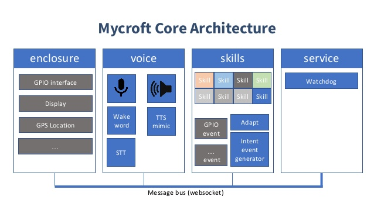
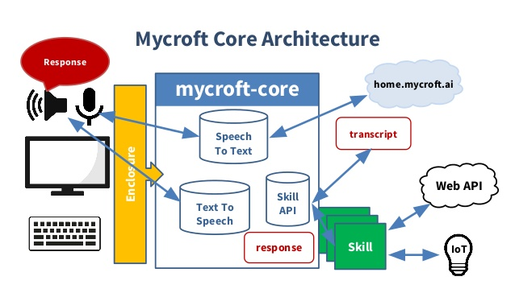

## Mycroft architecture

## Components

Source: https://www.slideshare.net/IntelSoftware/ai-io-t-and-voice-as-a-natural-interface

### Steps
Mycroft Core is the software that powers the voice assistant.
It runs on a Linux machine. It consists of four components each running as a separate process (enclosure, voice, skills and service).

1. Service starts the message bus which is a web-socket used by the processes to communicate with each other.

2. Precise running locally in the voice process starts recording audio upon hearing the wakeword.

3. The recorded audio is sent to the cloud for translation and transcription using DeepSpeech engine.

4. It returns the text of the audio(called utterance). The voice process puts this utterance back on the message bus.

5. The utterance is taken in by the adapt intent parser (inside skill process) which matches it with the list of locally installed skills that have registered vocabs(utterances that they handle).

6. Upon match with a skill, Adapt invokes the handler of the skill with the utterance and context (from context manager inside skill process).

7. The skill returns the dialog(response to the utterance) and is put on the message bus.

8. Voice picks this response and Mimic converts the text to speech (TTS).

9. Enclosure talks to the specific hardware and the software to make use of unique capabilities that the device may have.

###### Sources:
[1]    https://www.slideshare.net/IntelSoftware/ai-io-t-and-voice-as-a-natural-interface
