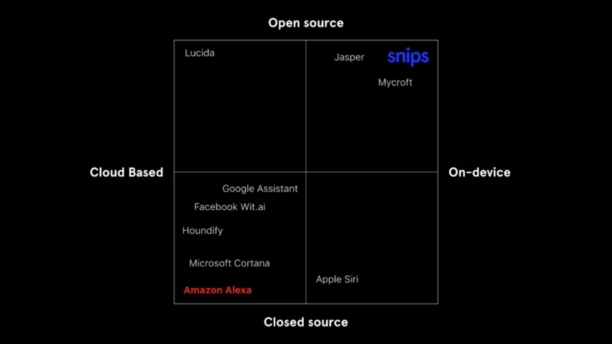

## Getting started
<!-- author: kirito_ys -->
<!-- 3:21 PM 09-May-18 -->
<!--  -->
***

### What is mycroft?

**mycroft is an open source voice assistant.**


<center> Source : https://www.youtube.com/watch?v=aG_qrmJxsWM </center>

It is inspired by Google search engine philosophy of programmatic feedback loop and Wikipedia's open-source nature that allows anyone to contribute. Mycroft plans to use both these features in AI as programmatic feedback loop (eg. to automatically push user corrected code) and open-source nature(including data).

documentation of mycroft ecosystem:  
https://mycroft.ai/documentation/

architecture of mycroft:
https://www.youtube.com/watch?v=pyc3wWYoI8E

#### How it works?
1. Keeps processing all audio input for a wake word locally.
2. Records speech(command) until silence detected or specified time has passed (default: 15 seconds).
3. Sends the audio to cloud for processing.
4. Cloud server sends back the text transcript.
5. Transcipt is parsed for finding the intent by matching with locally installed skills.
6. Skill with highest confidence match gets triggered with the intent passed to its handler.
7. Skill sends response on the bus for TTS.
8. Mycroft goes to sleep mode again. (Waiting for wakeword)

Sources:-
[Steps 1 and 2](https://mycroft.ai/blog/what-is-artificial-intelligence-and-how-does-mycroft-fit/)
[Steps 3 - 8](https://www.youtube.com/watch?v=pyc3wWYoI8E)
#### How to use Mycroft?
1. one can use the off the shelf Mark I or II with mycroft software and raspberry pi hardware.
2. other way is to download the mycroft image and flash on a raspberry pi yourself. In this case, you have to use a compatible microphone and speaker with the r-pi.
3. third method is to run the mycroft code on a linux machine. here, when executed it will use your machines speaker and microphone to work.
4. source code for android studio to build apks that install on an android device. speaker and mic of the android device will be used.
***
We will be using the second method for this project. The image is called picroft.
List of hardware that goes well with picroft:  
https://mycroft.ai/documentation/picroft/#hardware-recommendations

Link to picroft image:  
https://mycroft.ai/blog/mycroft-now-available-raspberry-pi-image/

Github code for picroft:  
https://github.com/MycroftAI/enclosure-picroft

Link to page about mycroft covering architecture, device and skill addition:
https://jan.newmarch.name/IoT/ArtificialIntelligence/Mycroft/

Checksum utility for windows:  
In CMD-
```
certUtil -hashfile <filename> <checksum_type>
```
here, checksum_type is SHA256

Installation of picroft using windows:  
https://www.raspberrypi.org/documentation/installation/installing-images/windows.mds

***

### Installing a GUI on picroft image

Install these packages in the machine and use `startx` in the terminal to start the GUI:
```
sudo apt-get install --no-install-recommends xserver-xorg
sudo apt-get install --no-install-recommends xinit
sudo apt-get install --no-install-recommends raspberrypi-ui-mods lxterminal gvfs
sudo apt-get install pavucontrol
```

***
### Configuring mic and speaker

Head to the section of setup sound in this article:
```
https://medium.com/snips-ai/build-a-weather-assistant-with-snips-4253541f1684
```
***
### Setting up remote connection to raspberrypi

Enable ssh and vnc in `Interfacing Options` in `rasp-config`.
```
sudo rasp-config
```

Then connect to the ip address of raspberrypi from remote machine.
On Windows use **Putty** for ssh and **VNC viewer** for VNC.

***
### Mounting USB storage device on Raspberry Pi

1. Find the device in `/dev/`. Remove and insert again to confirm which device file corresponds to the USB storage media.
2. Create mount directory in `/mnt/<foldername>/` e.g `/mnt/usb/`.
3. If sda is the device file then,
```
sudo mount /dev/sda /mnt/usb
```
***
### Disable skills in mycroft

1. Locate mycroft.conf

***
### Key-paths in the file system

Logs at:
```
/var/log/
```

home.mycroft.ai config file:
```
/opt/mycroft/web_config_cache.json
```

 mycroft.conf file is stored in:
```
/etc/mycroft/mycroft.conf
~/.mycroft/mycroft.conf
```

python packages of mycroft including adapt:
```
/usr/local/lib/python2.7/site-packages/mycroft_core-18.2.5-py2.7egg/mycroft
/usr/local/lib/python2.7/site-packages/adapt/
```

`mycroft.conf` file can be in these locations and written (hence overwritten) in order from Defaults to User. So, User path settings may overwrite others at the end.
```
mycroft-core/mycroft/configuration/mycroft.conf(Defaults)
Mycroft Home (Remote)
/etc/mycroft/mycroft.conf(Machine)
$HOME/.mycroft/mycroft.conf(User)
```


Anaconda3 path on Windows machine:
```
C:\Users\sesaxxxxxx\AppData\Local\Continuum\anaconda3\
```
***
